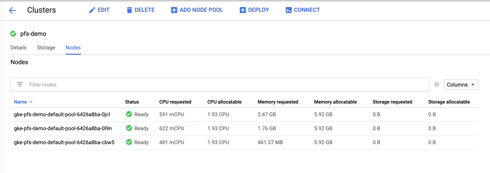
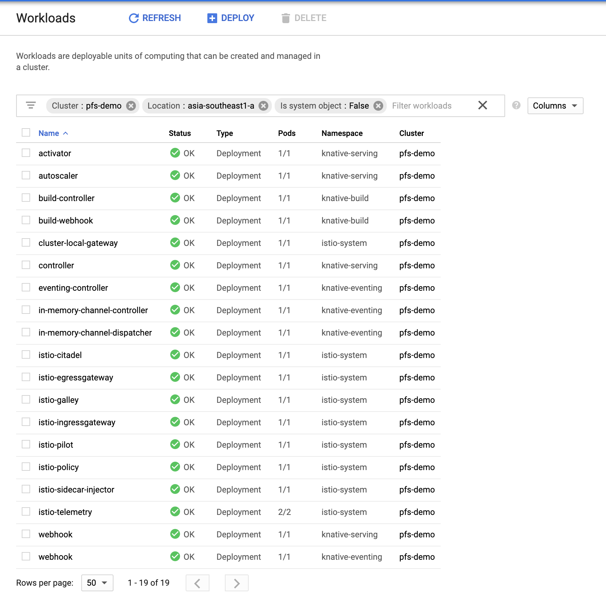

# Pivotal Function Service on GKE

## Requirement

- Google Cloud Account
- Google Cloud SDK (`gcloud`)
- [Pivotal Network (PivNet)](https://network.pivotal.io) Account

## Setup

- Create and configure account on GCP
- Setup Google Cloud SDK on you machine as per instructions [here](https://cloud.google.com/sdk/install)
- Download PFS artifacts from [PivNet](https://network.pivotal.io/products/pivotal-function-service).
  > **Note**: You will have to register and request early access to product. Its granted within a day or two generally
  - Get PFS thin distribution and PFS CLI
- Follow instruction in the PFS [documentation](https://docs.pivotal.io/pfs/0-2/install-on-gke.html) to setup PFS

  - Starting 0.2.0, you can use thin distribution, so there is no need to relocation images.
  - Skip the instruction to push images
  - Replace all `pfs-relocated` with `pfs-download`

## Setup PFS on GKE

### Prepare artifact

- Extract pfs distribution

  ```
  > mkdir pfs-download
  > tar -C pfs-download -xzvf ~/Downloads/pfs-distro-thin-20190521164510-08b9fce9d204f44218c10fb2614ae09ea09eeafa.tgz
  ```

### Prepare GKE Cluster

- Create GKE Cluster

  ```
  > gcloud container clusters create pfs-demo \
      --cluster-version=latest \
      --machine-type=n1-standard-2 \
      --enable-autoscaling \
      --min-nodes=1 \
      --max-nodes=3 \
      --enable-autorepair \
      --scopes=cloud-platform \
      --num-nodes=3 \
      --zone=asia-southeast1-a
  WARNING: In June 2019, node auto-upgrade will be enabled by default for newly created clusters and node pools. To disable it, use the `--no-enable-autoupgrade` flag.
  WARNING: Starting in 1.12, new clusters will have basic authentication disabled by default. Basic authentication can be enabled (or disabled) manually using the `--[no-]enable-basic-auth` flag.
  WARNING: Starting in 1.12, new clusters will not have a client certificate issued. You can manually enable (or disable) the issuance of the client certificate using the `--[no-]issue-client-certificate` flag.
  WARNING: Currently VPC-native is not the default mode during cluster creation. In the future, this will become the default mode and can be disabled using `--no-enable-ip-alias` flag. Use `--[no-]enable-ip-alias` flag to suppress this warning.
  WARNING: Starting in 1.12, default node pools in new clusters will have their legacy Compute Engine instance metadata endpoints disabled by default. To create a cluster with legacy instance metadata endpoints disabled in the default node pool, run `clusters create` with the flag `--metadata disable-legacy-endpoints=true`.
  WARNING: Your Pod address range (`--cluster-ipv4-cidr`) can accommodate at most 1008 node(s).
  This will enable the autorepair feature for nodes. Please see https://cloud.google.com/kubernetes-engine/docs/node-auto-repair for more information on node autorepairs.
  Creating cluster pfs-demo in asia-southeast1-a... Cluster is being health-checked (master is healthy)...done.
  Created [https://container.googleapis.com/v1/projects/pa-yrampuria/zones/asia-southeast1-a/clusters/pfs-demo].
  To inspect the contents of your cluster, go to: https://console.cloud.google.com/kubernetes/workload_/gcloud/asia-southeast1-a/pfs-demo?project=pa-yrampuria
  kubeconfig entry generated for pfs-demo.
  NAME      LOCATION           MASTER_VERSION  MASTER_IP       MACHINE_TYPE   NODE_VERSION  NUM_NODES  STATUS
  pfs-demo  asia-southeast1-a  1.13.7-gke.8    35.187.252.127  n1-standard-2  1.13.7-gke.8  3          RUNNING

  ```

  After installation your cluster in Google Cloud Console will look like this
  
  Goto [GCP / Kubernetes Engine](https://console.cloud.google.com/kubernetes/list)

- Get `kubectl` credentials

  ```
  > gcloud container clusters --zone asia-southeast1-a get-credentials pfs-demo
  Fetching cluster endpoint and auth data.
  kubeconfig entry generated for pfs-demo.
  ```

- Make myself admin for kubernetes

  ```
  > kubectl create clusterrolebinding cluster-admin-binding --clusterrole=cluster-admin --user=$(gcloud config get-value core/account)
  clusterrolebinding.rbac.authorization.k8s.io/cluster-admin-binding created
  ```

### Install and verify PFS

- Install pfs on GKE

  ```
  > pfs system install -m pfs-download/manifest.yaml
  Installing Istio components
  Applying resources defined in: istio-v1.0.7-riff.yaml

  Applying resources defined in: istio-v1.0.7-riff.yaml
  Istio components installed

  Waiting for the Istio components to start ... all components are 'Running'

  Installing Knative components
  Applying resources defined in: build.yaml
  Applying resources defined in: serving.yaml
  Applying resources defined in: clusterrole.yaml
  Applying resources defined in: eventing.yaml
  Applying resources defined in: in-memory-channel.yaml
  Applying resources defined in: riff-cnb-clusterbuildtemplate-0.2.0.yaml
  Knative components installed
  ```


    pfs system install completed successfully
    ```

- Verify installation

  ```
  > kubectl get pods --all-namespaces
  ```

    <details>
    <summary>Output</summary>  
    <p>

  ```
    NAMESPACE          NAME                                                 READY   STATUS    RESTARTS   AGE
    istio-system       cluster-local-gateway-5cdcbc79b9-9wfp6               1/1     Running   0          3m54s
    istio-system       istio-citadel-84cc99697d-hnwp2                       1/1     Running   0          4m42s
    istio-system       istio-egressgateway-78db6584df-pg8dr                 1/1     Running   0          2m53s
    istio-system       istio-egressgateway-78db6584df-pm2c8                 1/1     Running   0          4m46s
    istio-system       istio-galley-68cc49fd79-n4g5w                        1/1     Running   0          4m47s
    istio-system       istio-ingressgateway-6998857944-dvtzt                1/1     Running   0          4m45s
    istio-system       istio-pilot-86977d94ff-bd7h2                         2/2     Running   0          4m43s
    istio-system       istio-policy-75859d6946-bc84c                        2/2     Running   0          4m44s
    istio-system       istio-sidecar-injector-8458476f-rzbbc                1/1     Running   0          4m41s
    istio-system       istio-telemetry-8586d55cf4-5d7wx                     2/2     Running   0          4m43s
    knative-build      build-controller-7698746755-7b564                    1/1     Running   0          3m12s
    knative-build      build-webhook-6794b58fc-mkpng                        1/1     Running   0          3m12s
    knative-eventing   eventing-controller-88998bdf6-fq89d                  1/1     Running   0          2m49s
    knative-eventing   in-memory-channel-controller-5d8986dcfb-8t8jg        1/1     Running   0          2m43s
    knative-eventing   in-memory-channel-dispatcher-6cd8fdc44f-smrmf        2/2     Running   2          2m42s
    knative-eventing   webhook-85d8bd7bd4-p5sxj                             1/1     Running   0          2m49s
    knative-serving    activator-6f8b98d989-npkgm                           2/2     Running   0          3m2s
    knative-serving    autoscaler-69f6cc479c-dz4sr                          2/2     Running   0          3m1s
    knative-serving    controller-66f594ddf7-mwjfv                          1/1     Running   0          2m56s
    knative-serving    webhook-546765cbbf-nt9c7                             1/1     Running   0          2m55s
    kube-system        event-exporter-v0.2.4-5f88c66fb7-gj8wr               2/2     Running   0          11m
    kube-system        fluentd-gcp-scaler-59b7b75cd7-75lhp                  1/1     Running   0          10m
    kube-system        fluentd-gcp-v3.2.0-6b8sx                             2/2     Running   0          10m
    kube-system        fluentd-gcp-v3.2.0-gwk8j                             2/2     Running   0          10m
    kube-system        fluentd-gcp-v3.2.0-vtxff                             2/2     Running   0          10m
    kube-system        heapster-v1.6.0-beta.1-657d484f75-cgslh              3/3     Running   0          10m
    kube-system        kube-dns-6987857fdb-pcpc4                            4/4     Running   0          11m
    kube-system        kube-dns-6987857fdb-v7hhg                            4/4     Running   0          10m
    kube-system        kube-dns-autoscaler-bb58c6784-pww2k                  1/1     Running   0          10m
    kube-system        kube-proxy-gke-pfs-demo-default-pool-6426a8ba-0jcl   1/1     Running   0          10m
    kube-system        kube-proxy-gke-pfs-demo-default-pool-6426a8ba-0l9n   1/1     Running   0          10m
    kube-system        kube-proxy-gke-pfs-demo-default-pool-6426a8ba-cbw5   1/1     Running   0          10m
    kube-system        l7-default-backend-fd59995cd-jtcsp                   1/1     Running   0          11m
    kube-system        metrics-server-v0.3.1-57c75779f-zfwmf                2/2     Running   0          10m
    kube-system        prometheus-to-sd-2gssk                               1/1     Running   0          10m
    kube-system        prometheus-to-sd-69lwl                               1/1     Running   0          10m
    kube-system        prometheus-to-sd-s2vqt                               1/1     Running   0          10m

  ```

    </p>
    </details>

  Alternatively, on GKE you can checkout the [Workload](https://console.cloud.google.com/kubernetes/workload?workload_list_tablequery=%255B%257B_22k_22_3A_22metadata%252FclusterReference%252Fname_22_2C_22t_22_3A10_2C_22v_22_3A_22_5C_22pfs-demo_5C_22_22%257D_2C%257B_22k_22_3A_22metadata%252FclusterReference%252FgcpLocation_22_2C_22t_22_3A10_2C_22v_22_3A_22_5C_22asia-southeast1-a_5C_22_22%257D_2C%257B_22k_22_3A_22is_system_22_2C_22t_22_3A11_2C_22v_22_3A_22_5C_22false_5C_22_22_2C_22s_22_3Atrue%257D%255D&project=pa-yrampuria&folder&organizationId=265595624405&workload_list_tablesize=50) tab
  

- Create a service account to push images

```

> export GCP_PROJECT_ID=$(gcloud config get-value core/project)
  > gcloud projects add-iam-policy-binding $GCP_PROJECT_ID \

      --member serviceAccount:push-image@$GCP_PROJECT_ID.iam.gserviceaccount.com \
      --role roles/storage.admin

```

- Create and fetch an `push-image` authentication key

```

> gcloud iam service-accounts keys create \

      --iam-account "push-image@$GCP_PROJECT_ID.iam.gserviceaccount.com" \
      gcr-storage-admin.json

```

### Prepare a namesapce

- Prepare a namespace (default) with image push secret

```

> pfs namespace init default -m pfs-download/manifest.yaml --gcr gcr-storage-admin.json
> Initializing namespace "default"

Creating secret "push-credentials" with basic authentication to server "https://gcr.io" for user "\_json_key"
Creating serviceaccount "riff-build" using secret "push-credentials" in namespace "default"
Setting default image prefix to "gcr.io/pa-yrampuria" for namespace "default"

pfs namespace init completed successfully

```

### Enable outbound access

- To enable outbound access from your function, get cluster and service network cidr

```

> gcloud container clusters describe pfs-demo \
>  --zone=asia-southeast1-a | grep -e clusterIpv4Cidr -e servicesIpv4Cidr
> clusterIpv4Cidr: 10.48.0.0/14
> servicesIpv4Cidr: 10.51.240.0/20

```

- Edit `cm/config-network` from `knative-serving` namespace

```

> kubectl edit configmap config-network --namespace knative-serving

```

- In the editor, under `data` key, put following

```

istio.sidecar.includeOutboundIPRanges: "10.48.0.0/14,10.51.240.0/20"
clusteringress.class: "istio.ingress.networking.knative.dev"

```

This would make the file look like this:

```

# Please edit the object below. Lines beginning with a '#' will be ignored,

# and an empty file will abort the edit. If an error occurs while saving this file will be

# reopened with the relevant failures.

#

apiVersion: v1
data:
istio.sidecar.includeOutboundIPRanges: "10.48.0.0/14,10.51.240.0/20"
clusteringress.class: "istio.ingress.networking.knative.dev"
kind: ConfigMap
metadata:
annotations:
kubectl.kubernetes.io/last-applied-configuration: |
.....snip....

```

### Enable custom domain for Functions (Optional)

- Choose a root DNS name for you cluster. I am using `functions.runs-on.cf`
- For each namespace (Example: `default`), you need to create a wildcard DNS record (Example: `*.default.functions.runs-on.cf`).
- Get Istio ingress service's LB ip

```

> kubectl get service/istio-ingressgateway -n istio-system
> NAME TYPE CLUSTER-IP EXTERNAL-IP PORT(S) AGE
> istio-ingressgateway LoadBalancer 10.51.254.128 35.198.200.141 80:30083/TCP,443:30555/TCP,31400:30015/TCP,15011:30222/TCP,8060:32198/TCP,853:30781/TCP,15030:32696/TCP,15031:31745/TCP 61m

```

In this case its `35.198.200.141`

> If you are using GCP's Cloud DNS service, you can follow commands as below
>
> ```
> export DNS_ZONE=...
> export ROOT_DNS_NAME=...
> export FUNCTION_NS=default
> export GCP_PROJECT_ID=$(gcloud config get-value core/project)
> export LB_IP=$(kubectl get service/istio-ingressgateway -n istio-system -o jsonpath='{.status.loadBalancer.ingress[0].ip}')
> export NS_DNS="\*.${FUNCTION_NS}.${ROOT_DNS_NAME}."
>
> gcloud dns --project=$GCP_PROJECT_ID record-sets transaction start --zone=$DNS_ZONE
>
> gcloud dns --project=$GCP_PROJECT_ID record-sets transaction add $LB_IP --name="${NS_DNS}" --ttl=300 --type=A --zone=$DNS_ZONE
>
> gcloud dns --project=$GCP_PROJECT_ID record-sets transaction execute --zone=$DNS_ZONE
> ```

## Run Function

### First Function: Square in Javascript

Lets create a simple function that will reture square of a number. We will use code from the sample repository for this.

- Deploy the function

  ```

  > pfs function create square \
  >  --git-repo https://github.com/projectriff-samples/node-square \
  >  --artifact square.js
  > Applied default --image="gcr.io/pa-yrampuria/square"

  pfs function create completed successfully
  Issue `pfs service status square` to see the status of the function

  ```

* Check status

  ```

  > pfs service status square

  ```

  While the deployment is in progress you will see a status like this

  ```

  Last Transition Time: 2019-07-16T11:57:21+08:00
  Message: Configuration "square" is waiting for a Revision to become ready.
  Reason: RevisionMissing
  Status: Unknown
  Type: Ready

  ```

  Upon completion you should see the status as:

  ```

  Last Transition Time: 2019-07-16T12:00:07+08:00
  Status: True
  Type: Ready

  ```

- When function is ready, lets execute it

  ```

  > pfs service invoke square --text -- -w '\n' -d '2'
  curl 35.198.200.141/ -H 'Host: square.default.example.com' -H 'Content-Type: text/plain' -w '\n' -d 2
  4

  ```

  Or with a domain configured, you can run following

  ```

  > curl -H "content-type:application/json" -X POST http://square.default.functions.runs-on.cf -d "2"
  4

  ```

- Lets create some load and see what happens

  ```
  > for i in {1..1000}; do curl -H "content-type:application/json" -X POST http://square.default.functions.runs-on.cf -d "$i" ; done
  ```

  Lets examine the logs in functiun pod. First, findout pod.

  ```
  > kubectl get pods -l riff.projectriff.io/function=square
  NAME                                       READY   STATUS        RESTARTS   AGE
  square-bwbwn-deployment-79d9688fd4-rtg9c   2/3     Terminating   0          4m53s

  ```

  Next, get logs from the pod's `user-container` container

  ```
  > kubectl logs pods/square-bwbwn-deployment-79d9688fd4-rtg9c -c user-container

  ```

  Or do it in one go

  ```
  > kubectl logs $(kubectl get pods -l riff.projectriff.io/function=square -o jsonpath='{.items[0].metadata.name}') -c user-container
  ```

> **Note:** You can experience a delay in your execution on the first try

### Second function : Uppercase in Java

- Create a function from [git repo](https://github.com/projectriff-samples/java-boot-uppercase.git)

  ```

  > pfs function create uppercase \
      --git-repo https://github.com/projectriff-samples/java-boot-uppercase.git \
      --verbose

  ```

  [Output](second-function-create-output.md)

- Invoke function

  ```
  > pfs service invoke uppercase --text -- -w '\n' -d 'welcome to pfs'

  curl 35.198.200.141/ -H 'Host: uppercase.default.functions.runs-on.cf' -H 'Content-Type: text/plain' -w '\n' -d 'welcome to pfs'
  WELCOME TO PFS

  ```

  Or with domain configured

  ```
  > curl http://uppercase.default.functions.runs-on.cf -H 'Content-Type: text/plain' -w '\n' -d 'welcome to pfs'
  WELCOME TO PFS
  ```

### Third Function: Cube in Local Javascript

So far we have only used git based project to create functions. Lets create a function from a file on local machine

- Create a function

  ```
  > pfs function create cube --artifact index.js --local-path samples/cube
  ```

  <details>
    <summary>Output</summary>
    <p>

      Applied default --image="gcr.io/pa-yrampuria/cube"
      Using user-provided builder image docker.io/projectriff/builder@sha256:dccac174b2e80186aab20ed3a52a61e8a69d6c023e16f45c53c6385d7f5b5c4c
      Pulling builder image docker.io/projectriff/builder@sha256:dccac174b2e80186aab20ed3a52a61e8a69d6c023e16f45c53c6385d7f5b5c4c (use --no-pull flag to skip this step)
      sha256:dccac174b2e80186aab20ed3a52a61e8a69d6c023e16f45c53c6385d7f5b5c4c: Pulling from projectriff/builder
      898c46f3b1a1: Already exists
      63366dfa0a50: Already exists
      041d4cd74a92: Already exists
      6e1bee0f8701: Already exists
      736a2f2678d0: Pull complete
      c14514b920d6: Pull complete
      4e1c50360d2b: Pull complete
      3091b80d6304: Pull complete
      c2cb47c11953: Pull complete
      3982579fd5a8: Pull complete
      531565c98c9c: Pull complete
      13b848540f6a: Pull complete
      69d1a5f060c5: Pull complete
      b55ffc638af0: Pull complete
      0ffc444ee6be: Pull complete
      66e517d5f297: Pull complete
      aee2cd7e2ed2: Pull complete
      93c91f1b7d68: Pull complete
      a9c407174383: Pull complete
      e2ea1ee3ddf3: Pull complete
      30d2e8cfec82: Pull complete
      Digest: sha256:dccac174b2e80186aab20ed3a52a61e8a69d6c023e16f45c53c6385d7f5b5c4c
      Status: Downloaded newer image for projectriff/builder@sha256:dccac174b2e80186aab20ed3a52a61e8a69d6c023e16f45c53c6385d7f5b5c4c
      Using user-provided run image docker.io/packs/run@sha256:99dee5262498d21b302321fd5d7b889c1685bfbd0ea12a64f786d91232e52278
      Using cache image pack-cache-ab01782db352
      ===> DETECTING
      [detector] Trying group of 3...
      [detector] ======== Results ========
      [detector] Cloud Foundry OpenJDK Buildpack: pass
      [detector] Cloud Foundry Build System Buildpack: skip
      [detector] Java Function Buildpack: fail
      [detector] Trying group of 3...
      [detector] ======== Output: NPM Buildpack ========
      [detector] no "package.json" found at: /workspace/package.json
      [detector] ======== Results ========
      [detector] Node.js Buildpack: pass
      [detector] NPM Buildpack: skip
      [detector] Node Function Buildpack: pass
      ===> RESTORING
      [restorer] cache image 'pack-cache-ab01782db352' not found, nothing to restore
      ===> ANALYZING
      [analyzer] WARNING: image 'gcr.io/pa-yrampuria/cube' not found or requires authentication to access
      [analyzer] WARNING: image 'gcr.io/pa-yrampuria/cube' has incompatible 'io.buildpacks.lifecycle.metadata' label
      ===> BUILDING
      [builder] -----> Node.js Buildpack 0.0.4
      [builder] -----> NodeJS 11.9.0: Contributing to layer
      [builder]        Downloading from https://nodejs.org/dist/v11.9.0/node-v11.9.0-linux-x64.tar.gz
      [builder]        Verifying checksum
      [builder]        Expanding to /layers/org.cloudfoundry.buildpacks.nodejs/node
      [builder]        Writing NODE_HOME to shared
      [builder]        Writing NODE_ENV to shared
      [builder]        Writing NODE_MODULES_CACHE to shared
      [builder]        Writing NODE_VERBOSE to shared
      [builder]        Writing NPM_CONFIG_PRODUCTION to shared
      [builder]        Writing NPM_CONFIG_LOGLEVEL to shared
      [builder]        Writing WEB_MEMORY to shared
      [builder]        Writing WEB_CONCURRENCY to shared
      [builder]
      [builder] -----> Node Function Buildpack 0.1.0
      [builder] -----> riff Node Invoker 0.1.0: Contributing to layer
      [builder]        Reusing cached download from buildpack
      [builder]        Expanding to /layers/io.projectriff.node/riff-invoker-node
      [builder]        npm-installing the node invoker
      [builder] added 76 packages from 60 contributors and audited 524 packages in 6.86s
      [builder] found 10 vulnerabilities (2 moderate, 8 high)
      [builder]   run `npm audit fix` to fix them, or `npm audit` for details
      [builder]        Writing HOST to launch
      [builder]        Writing HTTP_PORT to launch
      [builder] -----> NodeJS index.js: Contributing to layer
      [builder]        Writing FUNCTION_URI to launch
      [builder] -----> Process types:
      [builder]        web:      node /layers/io.projectriff.node/riff-invoker-node/server.js
      [builder]        function: node /layers/io.projectriff.node/riff-invoker-node/server.js
      [builder]
      ===> EXPORTING
      [exporter] WARNING: image 'gcr.io/pa-yrampuria/cube' not found or requires authentication to access
      [exporter] WARNING: image 'gcr.io/pa-yrampuria/cube' has incompatible 'io.buildpacks.lifecycle.metadata' label
      [exporter] adding layer 'app' with diffID 'sha256:8618f252927a67b4856d338bf0b45006a19f5c0db58efd85f60cf7b3af84364e'
      [exporter] adding layer 'config' with diffID 'sha256:cf44337980f6134288892bb30effa9049e9c54a409ebbca9cc978fbc83ca6269'
      [exporter] adding layer 'launcher' with diffID 'sha256:7417c05f2e27d60b777911b95a538f0bac23fec8fec4175a499039949781fabc'
      [exporter] adding layer 'org.cloudfoundry.buildpacks.nodejs:node' with diffID 'sha256:52c3a02d18e4ead68628d5d5fcb833f54b7005bf925c71f40aa17a438949d431'
      [exporter] adding layer 'io.projectriff.node:function' with diffID 'sha256:a61aa100d7f7853143a51bad4814dfc5d5f4c05d0375be41875867fa86c0de7a'
      [exporter] adding layer 'io.projectriff.node:riff-invoker-node' with diffID 'sha256:ecd4fdde719a81c8273904aa4f3d22ad79384380c5c3c7c38406d267b6c7672d'
      [exporter] setting metadata label 'io.buildpacks.lifecycle.metadata'
      [exporter] setting env var 'CNB_LAYERS_DIR=/layers'
      [exporter] setting env var 'CNB_APP_DIR=/workspace'
      [exporter] setting entrypoint '/lifecycle/launcher'
      [exporter] setting empty cmd
      [exporter] writing image
      [exporter]
      [exporter] *** Image: gcr.io/pa-yrampuria/cube@sha256:5a7fd1768dfa0c9172218e6c2c71663f2196a6ad9c565e5c20e3fc0559a6b5e6
      ===> CACHING
      [cacher] WARNING: image 'pack-cache-ab01782db352' not found or requires authentication to access
      [cacher] WARNING: image 'pack-cache-ab01782db352' has incompatible 'io.buildpacks.lifecycle.cache.metadata' label
      [cacher] adding layer 'org.cloudfoundry.buildpacks.nodejs:0e872c288724e7de72eaa89d1fbc29979a60cdc8c4c0bc1ea65339328bbaaf4c' with diffID 'sha256:18acead142fd52c49704a97bfdfee2f64191abb089ed3a9c805cd4d9180d0235'
      [cacher] adding layer 'org.cloudfoundry.buildpacks.nodejs:node' with diffID 'sha256:52c3a02d18e4ead68628d5d5fcb833f54b7005bf925c71f40aa17a438949d431'
      [cacher] setting metadata label 'io.buildpacks.lifecycle.cache.metadata'
      [cacher] writing image
      [cacher] cache 'pack-cache-ab01782db352@0cc8f685b346221e4ea4a21bd005ae3031a2af27d59ca5dd475954f672ac284e'

      pfs function create completed successfully
      Issue `pfs service status cube` to see the status of the function

  </p>
  </details>

  This is building your code using Cloud Native buildpacks. It detects your application type automaticaly and runs the correct buildpack.

-

## References

- [Install PFS on GKE](https://docs.pivotal.io/pfs/0-2/install-on-gke.html)
- [Sample Application Code]()
